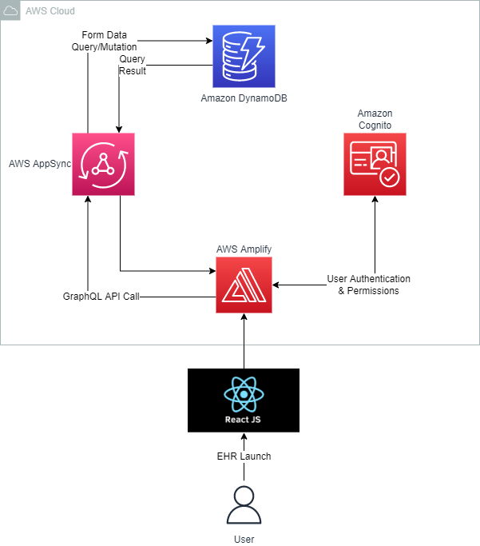

# Basics for Health

| Index                                               | Description                                             |
| :-------------------------------------------------- | :------------------------------------------------------ |
| [High Level Architecture](#high-level-architecture) | High level overview illustrating component interactions |
| [Deployment](#deployment-guide)                     | How to deploy the project                               |
| [User Guide](#user-guide)                           | The working solution                                    |
| [Files/Directories](#files-and-directories)         | Important files/directories in the project              |
| [Changelog](#changelog)                             | Any changes post publish                                |
| [Credits](#credits)                                 | Meet the team behind the solution                       |
| [License](#license)                                 | License details                                         |

# High Level Architecture

The following architecture diagram illustrates the various AWS components utliized to deliver the solution. For an explanation of the stack, refer to the [Architecture Deep Dive](docs/ArchitectureDeepDive.md).



# Deployment Guide

To deploy this solution, please follow the steps laid out in the [Deployment Guide](docs/DeploymentGuide.md).

# User Guide

For instructions on how to navigate the web app interface, refer to the [Web App User Guide](docs/UserGuide.md).

# Files And Directories

```text
.
├── amplify
├── docs/
│   ├── images/
│   ├── ArchitectureDeepDive.md
│   ├── DeploymentGuide.md
│   └── UserGuide.md
├── node_modules
├── public
├── src/
│   ├── components/
│   │   ├── navbar.js
│   │   └── sidebar.js
│   ├── graphql/
│   ├── pages/
│   │   ├── admin.js
│   │   ├── form.js
│   │   └── upload.js
│   ├── adminStatus.js
│   ├── App.css
│   ├── App.js
│   ├── aws-exports.js
│   ├── index.css
│   ├── index.js
│   ├── reportWebVitals.js
│   └── setupTests.js
├── .gitignore
├── .graphqlconfig.yml
├── .amplify.yml
├── package-lock.json
├── package.json
└── README.md
```

1. **`/docs`**: Contains all relevant documentation files
2. **`/public`**: Contains library for rendering the forms
3. **`/src`**: Contains all the source code for the website
   1. **`/components`**: Reusable React components
      - navbar.js: App bar for the application
      - sidebar.js: Menu to help users navigate between pages
   2. **`/graphql`**: Contains files for mutations, queries and the schema
   3. **`/pages`**: Files for each individual page of the app
   4. **`/adminStatus.js`**: File for checking if the user is an admin

# Changelog
N/A

# Credits

This application was architected and developed by Eric Liu with guidance from the UBC CIC technical and project management teams.

# License

This project is distributed under the [MIT License](https://github.com/git/git-scm.com/blob/main/MIT-LICENSE.txt).
