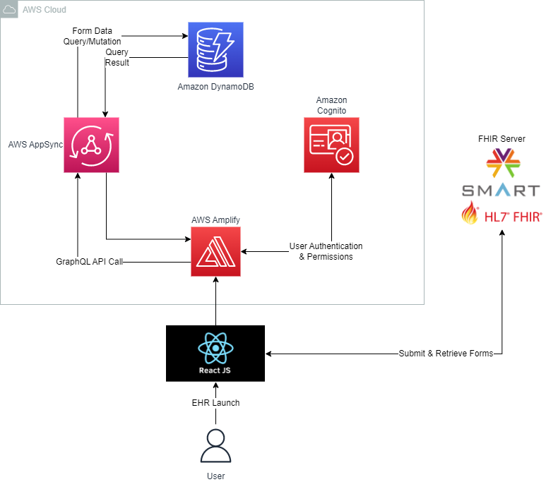

# Stack Deep Dive

## Architecture

## Flow Diagram

## EHR Launch + Authorization Flow

1. User launches the application from an EHR

2. The selected patient's data (name, id) is retrieved from the EHR

3. The application makes a request to the FHIR server for its SMART configuration metadata

4. The FHIR server returns a document that contains the authorization server's endpoint

5. The application makes an authorization request to the authorization server, as well as what data it wishes to access (as defined in the scope)

6. The authorization server returns an authorization code

7. The application exchanges the authorization code for an access token, which is used to authorize requests to the FHIR server

8. The user then signs in to the application through Amazon Cognito, which assigns them different permissions depending on if they are an admin user or not

## Uploading Forms

9. When the user uploads their own forms in the app, the FHIR Questionnaire resource is created and stored on the FHIR server

10. The server responds to the request with data about the created resource, including its unique ID

11. Relevant data about the form (name, version, ID, author, if another user is given access) is then stored into Amazon DynamoDB

## Filling Out Forms

12. To render the form that has been selected to be filled out, the application first queries the database to find the ID of the resource that corresponds to the version of the form selected

13. A request to get the Questionnaire resource with the appropriate ID is made to the FHIR server

14. A second request is made to the server to get the previous answers (QuestionnaireResponse resource) to the form. If the user has filled out the form before, the answers will be loaded with it, otherwise a blank form will be rendered

15. After the user fills out the form and submits it, the answers (QuestionnaireResponse resource) are stored on the FHIR server