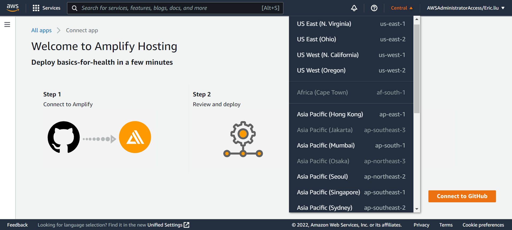
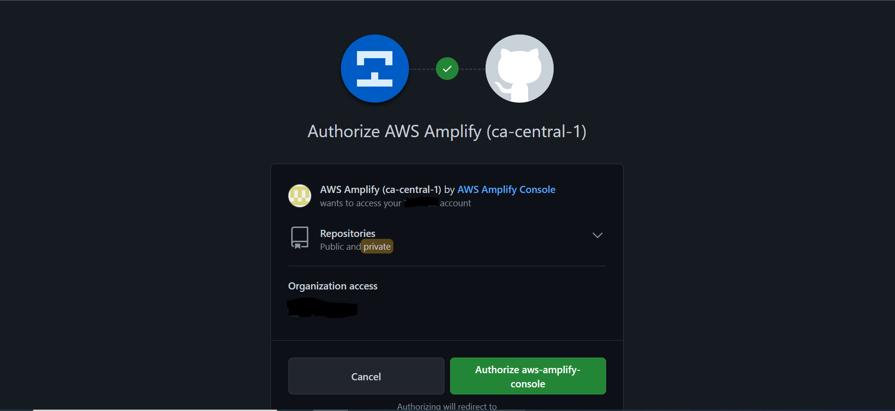
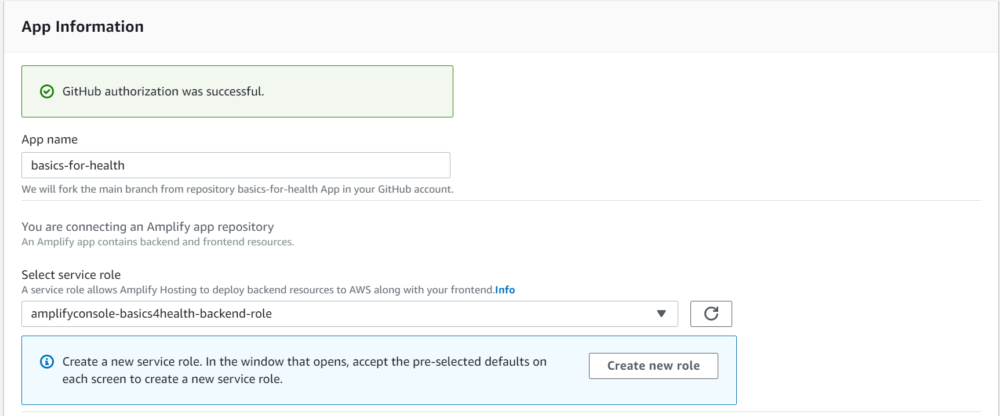
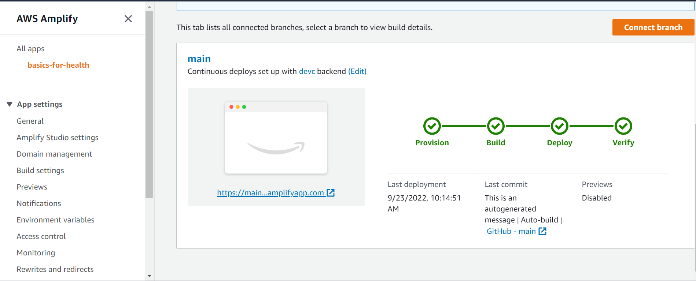
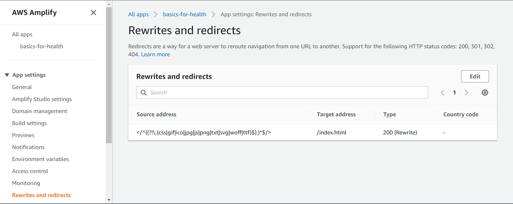
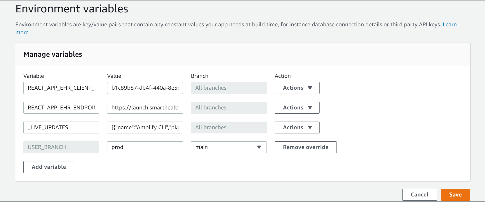

# Requirements

Before you deploy, you must have the following accounts:

- [AWS Account](https://aws.amazon.com/account/)
- [GitHub Account](https://github.com/)

You must also have the following installed on your device:

- [Git](https://git-scm.com/downloads)
- [AWS CLI](https://aws.amazon.com/cli/)

**The application is configured to launch from an EHR. If you do not have access to one, [this](https://launch.smarthealthit.org/?auth_error=&fhir_version_2=r4&iss=&launch_ehr=1&launch_url=&patient=&prov_skip_auth=1&provider=&pt_skip_auth=1&public_key=&sde=&sim_ehr=1&token_lifetime=15&user_pt=) simulates an EHR and can be used to test the app.**

# Clone The Repository

First, clone the GitHub repository onto your machine. To do this:

1. Create a folder on your computer to contain the project code.
2. For an Apple computer, open Terminal. If on a Windows machine, open Command Prompt or Windows Terminal. Enter into the folder you made using the command `cd path/to/folder`. To find the path to a folder on a Mac, right click on the folder and press `Get Info`, then select the whole text found under `Where:` and copy with ⌘C. On Windows (not WSL), enter into the folder on File Explorer and click on the path box (located to the left of the search bar), then copy the whole text that shows up.
3. Clone the github repository by entering the following:

```bash
git clone https://github.com/UBC-CIC/basics-for-health.git
```

The code should now be in the folder you created. Navigate into the folder containing the Amplify project by running the command:

```bash
cd basics-for-health
```

# Deployment

Before deploying the Amplify project we need to create an IAM Role that will give us the permissions needed to implement this solution. Run the following line of code:

```bash
aws cloudformation deploy --template-file cfn-amplifyRole.yaml --stack-name amplifyconsole-basics4health-backend-role --capabilities CAPABILITY_NAMED_IAM
```

If you have multiple AWS Profiles, use the one with sufficient admin permissions by appending the following text to the end of the command, replacing the profile name with the profile you would like to use for the solution.

```bash
--profile [PROFILE NAME]
```

This step creates an IAM role called **amplifyconsole-basics4health-backend-role** that will be used on the next step.

The **Deploy to Amplify Console** button will take you to your AWS console to deploy the solution. Make sure you are logged into your AWS account.

<a href="https://console.aws.amazon.com/amplify/home#/deploy?repo=https://github.com/UBC-CIC/basics-for-health">
    
</a>

1. On the AWS console, select your region and click `Connect to GitHub`.
   
2. Authorize AWS Amplify with your GitHub account (if required).
   
3. Select the **amplifyconsole-basics4health-backend-role** we made previously for the deployment role, and then press `Save and Deploy`
   
4. The deployment will take a few minutes. Wait until the status of **Verify** is green
   
5. On the left side menu, click on `Rewrites and redirects` and click the `Edit` button. Click and replace the first rule's **source address** (or add a rule if there is none) to `</^((?!\.(css|gif|ico|jpg|js|png|txt|svg|woff|ttf)$).)*$/>`. Replace the **target address** to `/index.html`, and replace the **type** to `200 (Rewrite)`. Refer to [AWS's Page on Single Page Apps](https://docs.aws.amazon.com/amplify/latest/userguide/redirects.html#redirects-for-single-page-web-apps-spa) for further information on why that was necessary.
    
    It should look like this once you are done:
    

6. On the left side menu, click on `Environment variables` and then the `Manage variables` button. Add the following and save the change. If you are using the demo EHR, the endpoint is https://launch.smarthealthit.org/v/r4/fhir
   ```bash
   Variable: REACT_APP_EHR_ENDPOINT    Value: [Your FHIR endpoint]
   ```
   

The app is now deployed!

The next step is to register the application with your EHR. Doing so will provide a unique Client ID associated with the app, along with a Client Secret. **If you are using the demo EHR, any string for the client ID and secret will work as its not validated on the test server.** Add the following environment variables to Amplify:
```bash
Variable: REACT_APP_EHR_CLIENT_ID	Value: [Your Client ID]
Variable: REACT_APP_EHR_CLIENT_SECRET	Value: [Your Client Secret]
```


If you wish to make changes and further contribute to this project, install the required packages and dependencies with the following command:

```bash
npm install
```