# User Guide

**Before Continuing with this User Guide, please make sure you have deployed the application.**

- [Deployment Guides](./DeploymentGuide.md)

| Index                              | Description                            |
| :--------------------------------- | :------------------------------------- |
| [Demo EHR](#demo-ehr)              | Simulated EHR for app launch           |
| [Form Builder](#form-builder)      | Tool for creating the FHIR forms       |
| [Main Page](#main-page)            | Fill out forms                         |
| [Upload Form](#upload-form)        | Upload new / update existing forms     |
| [Add Admin User](#add-admin-user)  | Set other users as admins              |

## Demo EHR

The following steps are for if you are using the demo EHR to launch the app. As this is a public test server, **resources are removed from the server after a day**. Also, after submitting a form it may take time for this server to receive the request, so the answers for the form may not load immediately the first time.

Scroll down and enter the app URL in the `App Launch URL` field.
    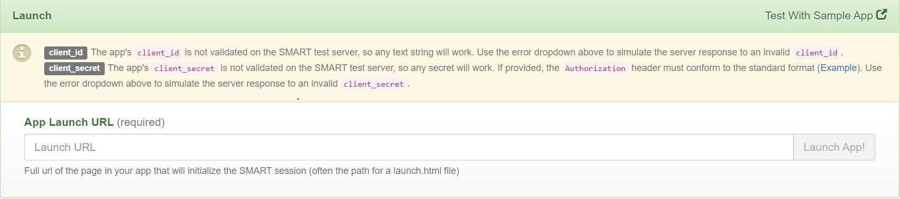

Log in as the provided practitioner and select a patient from the list. The sign in/sign up screen for the app will then be displayed.

## Form Builder

This application does not create the FHIR-based forms themselves. To actually create these forms, online tools exist for building FHIR questionnaires. The one we used can be found [here](https://lhcformbuilder.nlm.nih.gov/previous/).
    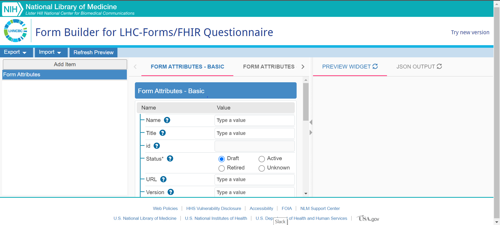

When adding questions, please use LOINC codes when possible.
    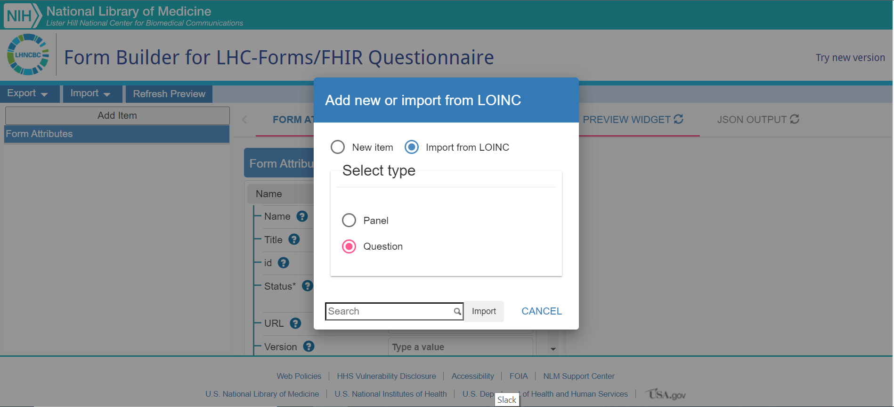

After you are finished building your form, click `Export` to download it as a file; this is what will be uploaded to the application.

If updating an existing form, click `Import` and select the one you wish to edit. After you make your changes, download it again and upload it to the update page of the application.

**Note**: In this repository, there is a JSON file attached (`/b4h-questionnaire.json`) that contains a FHIR Questionnaire resource. This was created specifically for the sponsor of this project, but may be used to upload to the application when first trying it out.

## Main Page

**This will be the only page available to regular, non-admin users.**

When a user signs in, the first page shown will be the page for filling out forms.
    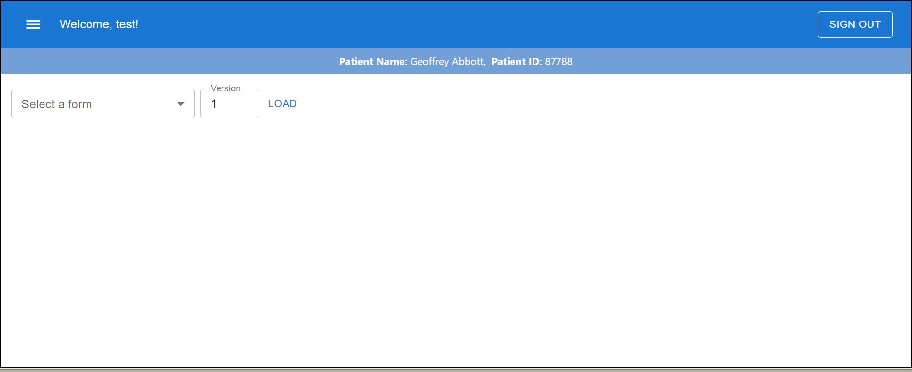

There is a dropdown menu that will display all the forms that the user has uploaded or that has been assigned to them. Next to it is a spinbox that allows the user to pick the version of the form to render (if updates have been made to it). Clicking on `LOAD` after selecting a form and its version will render the form to be filled out.
    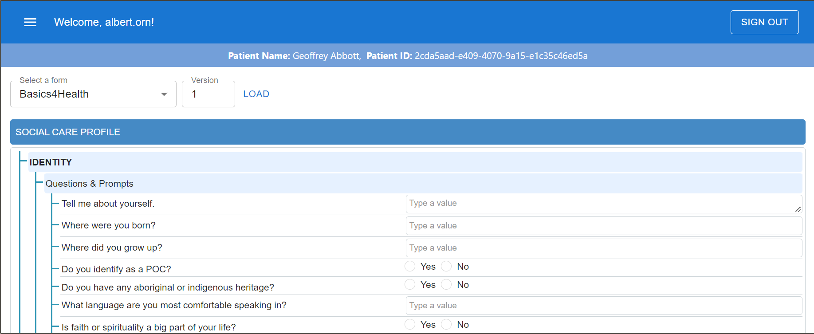

If the form has been submitted before, the answers will also be loaded with it.

## Upload Form

This page allows admin users to either upload new forms or update existing ones.

When uploading a new one, a name for the form is required; this is what will be shown in the dropdown selection menu. There is another field (optional) that allows the user to enter the name of another user to give them access to the form as well.
    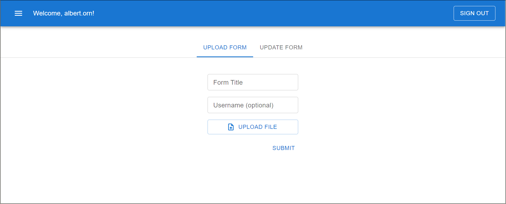

When updating an existing one, the user must select the form they are updating from the dropdown menu.
    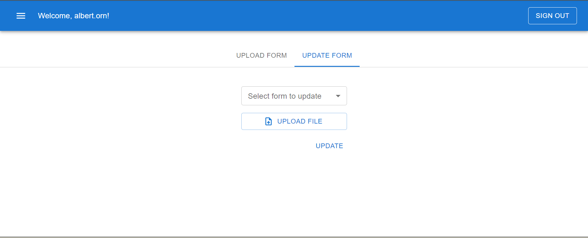

## Add Admin User

This page allows the admin user to set other users as admins.
    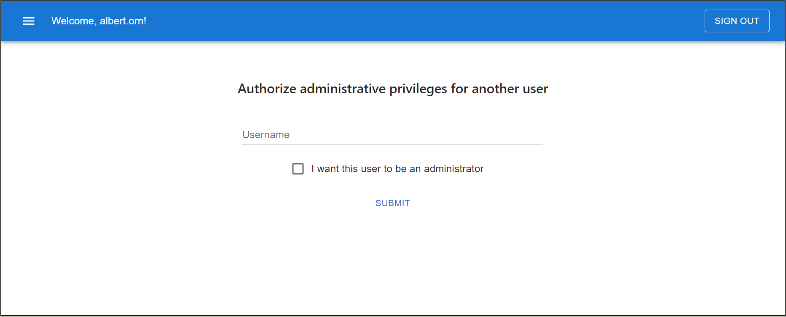

To set up the **first** admin account, you will need to do the following steps. (Note: this assumes the user has already signed up on the app)

1. On the [AWS online console](https://console.aws.amazon.com/console/home), enter `Cognito` in the search bar.
   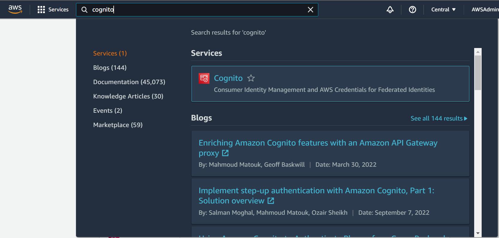
2. Click `Manage User Pools` and select the user pool that corresponds to the project name. The following screen will then be shown.
   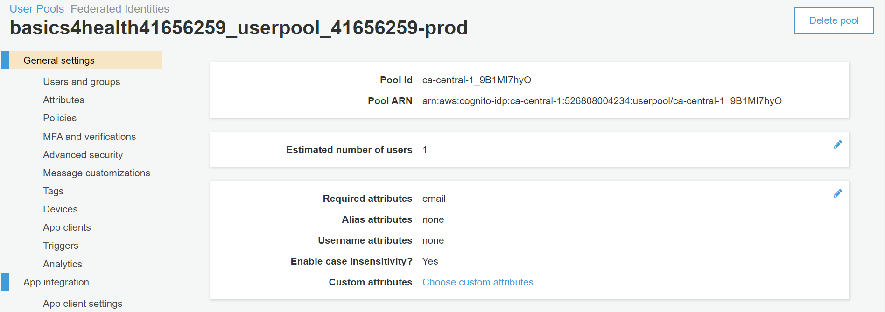
3. On the left side menu, under General settings, click `Users and groups`. Select the user you wish to set as an admin.
   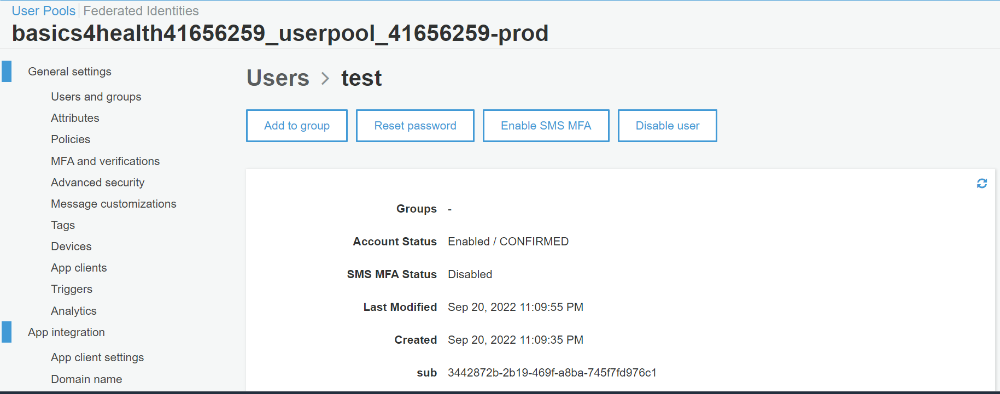
4. Click the `Add to group` button and select **Admins** from the drop down menu.
   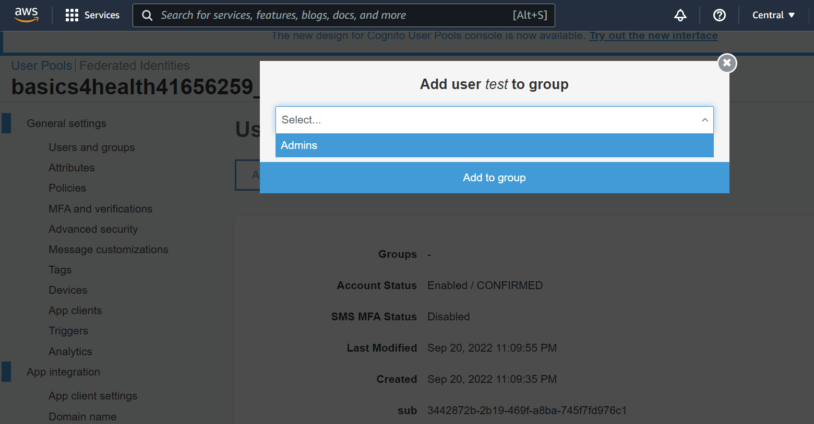

    You must sign out of the app and sign back in to see the change.
